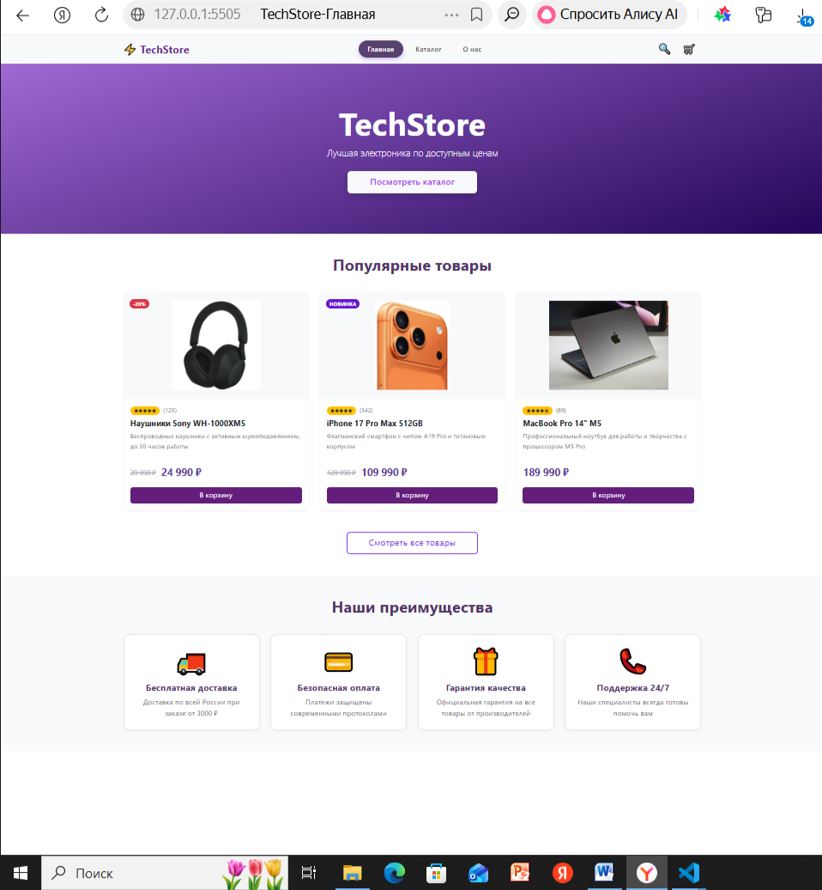
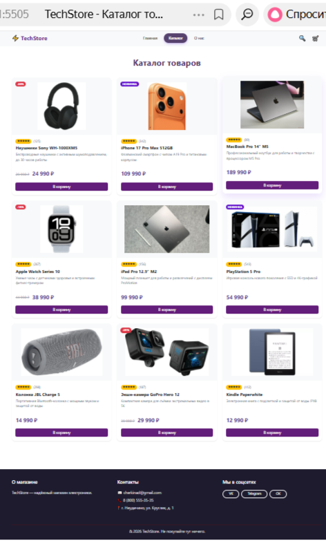
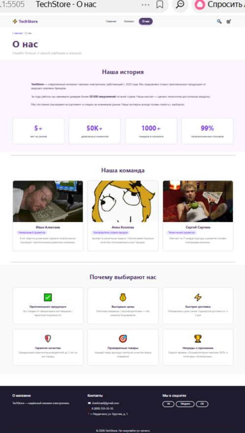

# Лабораторная работа №14-16 - Интернет-магазин "TechStore"

**ФИО:** Черкина Дарья Алексеевна  
**Группа:** ИСП-231  
**Дата:** 17.04.2026  

## Описание проекта

Многостраничный сайт интернет-магазина электроники "TechStore" с адаптивной вёрсткой.

## Реализованные страницы

- **Главная** — приветственный баннер, популярные товары, преимущества
- **Каталог** — сетка из 9 карточек товаров
- **О нас** — информация о магазине и команде

## Реализованные функции

- Адаптивное навигационное меню
- Карточки товаров с hover-эффектами
- CSS Grid для каталога (3 колонки)
- Flexbox для навигации и футера
- Адаптивная вёрстка (desktop / tablet / mobile)
- Единая цветовая схема (фиолетовый #7c3aed)
- Семантическая HTML5-разметка

## Технологии

- HTML5
- CSS3 (Flexbox, Grid, Media Queries)
- Bootstrap 5.3
- Git / GitHub

## Скриншоты

